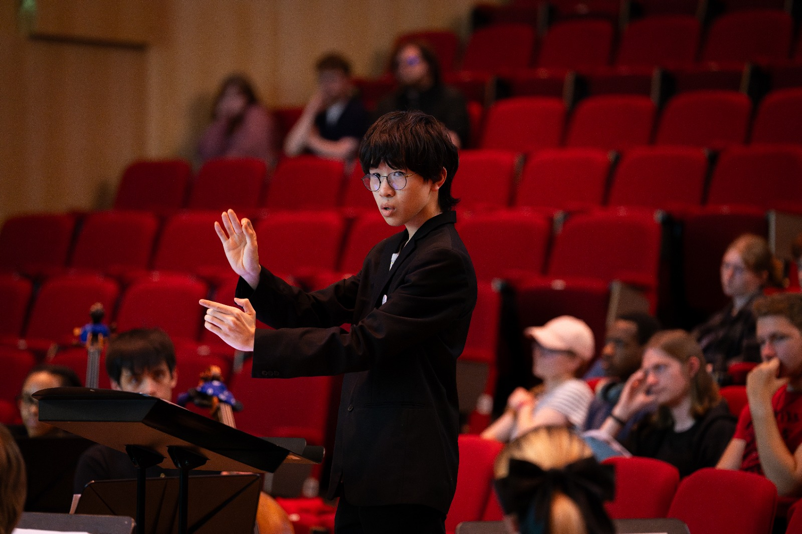
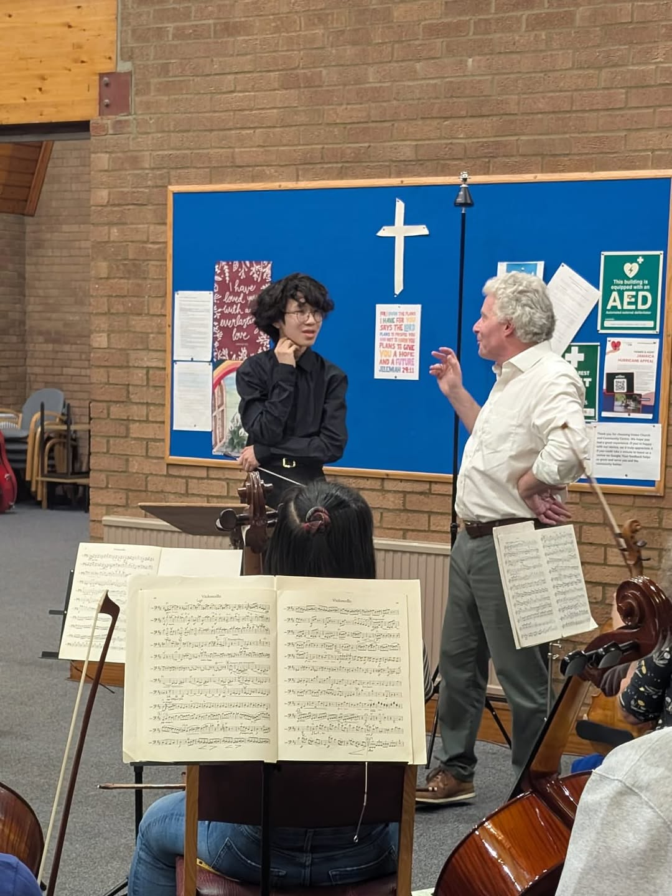
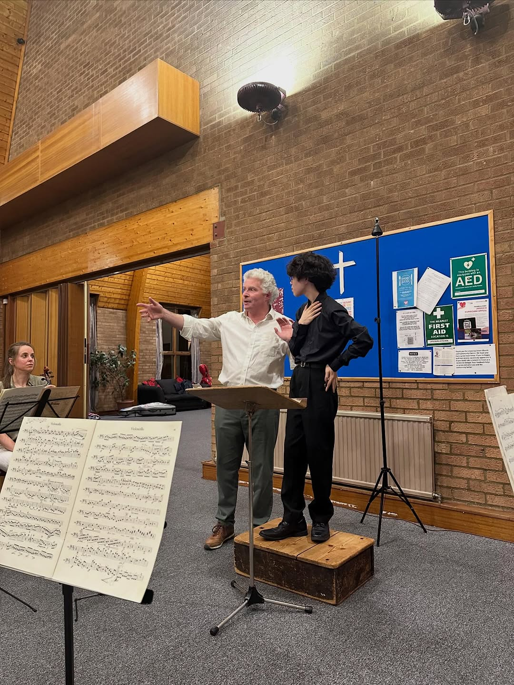

# Biography

<ul class="rotator" data-rotate="7000" markdown>
<li markdown>
Conrad really has something. That right there is good conducting because they actually listen to the
music.
Denise Ham
</li>
</ul>

{ .side .inset .no-lightbox }

Conrad is an emerging orchestral conductor, with experience across symphonic, string, and wind ensemble repertoire. Their conducting style focuses on clarity and minimal distraction to the players, in order to encourage confidence and a diplomatic musical direction.

They currently hold positions within various on-campus ensembles. Following a previous engagement as Guest Conductor with the *String Society*, they return as its Principal Conductor for the 2026–27 season, alongside Assistant Conductor of the *Wind Orchestra*. Coming engagements with these ensembles, as part of *Royal Holloway’s International Concert Series*, include repertoire such as Gershwin’s *Rhapsody in Blue*.

Previously, they served as Junior Assistant Conductor of the *Royal Holloway Symphony Orchestra* under [Rebecca Miller](https://www.rebeccamiller.net/), contributing through conducting in rehearsals and sectional work. They have also engaged in rehearsal observation and feedback within departmental performance projects, including concerto and soloist collaborations.

{ .lede-image .no-lightbox }

Their orchestral training began at the *Junior Royal Birmingham Conservatoire* (JRBC) under [Margarita Mikhailovna](https://www.margaritamikhailova.com/), alongside instrumental studies in flute ([Liz Wrighton](https://www.bcu.ac.uk/conservatoire/about-us/birmingham-conservatoire-tutors-and-staff/elizabeth-wrighton)) and violin ([Sam Mason](https://www.midlandchamberplayers.org.uk/players.aspx)). They have additionally received mentorship from [Jeff Snowdon](https://www.bcu.ac.uk/conservatoire/about-us/birmingham-conservatoire-tutors-and-staff/jeff-snowdon) and [Monica Leiher](https://www.bcu.ac.uk/conservatoire/about-us/birmingham-conservatoire-tutors-and-staff/monica-leiher). After completing their studies at JRBC, aged 16, to pursue university education, they have participated in competitive conducting programmes and masterclasses. As one of four participants in a masterclass with Prof. [Colin Metters](https://www.colinmetters.com/), they worked on Berlioz’s *Symphonie fantastique* as part of the Girton Conducting Course. Through working with orchestral repertoire — including Schubert’s Symphony No. 5, Brahms’ *Academic Festival Overture*, Bizet’s *L’Arlésienne* suites, and Stravinsky’s *Octet* — they received tuition in the *Toscanini–Barzin* technique under tutors including [Dominic Grier](https://www.dominicgrier.com/), [Cathal Garvey](http://cathalgarvey.com/), [Leif Tse](https://www.leiftse.com/), and [Denise Ham](https://www.deniseham.com/), who remarked that *“Conrad really has something. That right there is good conducting because they actually listen to the music.”* They were also selected as one of four participants for the *North London Symphony Orchestra* masterclass, working on Brahms’ Symphony No. 2 with [Robert Max](https://www.ram.ac.uk/profile/robert-max).

Apart from their musical endeavours, Conrad is currently a 3rd year Theoretical Physics BSc student at *Royal Holloway*, where their academic background motivated an analytical approach to score study.

{ .lede-image .no-lightbox }

## Positions

### Current
| Ensemble | Role | Years |
|---|---|---|
| Royal Holloway String Society | Principal Conductor | 2026–27 |
| Royal Holloway Wind Orchestra | Assistant Conductor | 2026–27 |

### Past
| Ensemble | Role | Years |
|---|---|---|
| Royal Holloway String Society | Guest Conductor | 2025–26 |
| Royal Holloway Symphony Orchestra | Junior Assistant Conductor | 2024–25 |
| Junior Royal Birmingham Conservatoire | Assistant/Student Conductor | 2023–24 |

