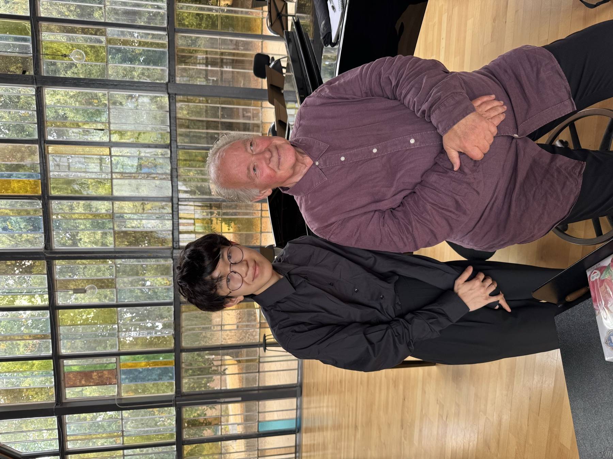

---
hide:
  - toc
description: Book Conrad Ho for assistant, guest, or principal conducting engagements.
---
# Enquiries
{ .inset .side}

I am currently open to positions ranging from assistant conducting, covering rehearsals and guest conducting for a concert, through to full principal conductor positions. If you have any relevant opportunities, I'd be very interested to hear more!

## For an engagement

Please **[email me](mailto:conradkhho@gmail.com)** about: your ensemble, the repertoire, the date(s), as well as any details that might be relevant.

## Let's chat

Please book via the form below if you'd like to organise an online call.

**NB**: these are **not** for booking concert or rehearsal dates.

--8<-- "booking.md"

---

[Biography](biography.md) · [Repertoire](repertoire.md) · [Media](media.md) ·
[Concerts](concerts/index.md) · [Full contact details](../contact.md)
