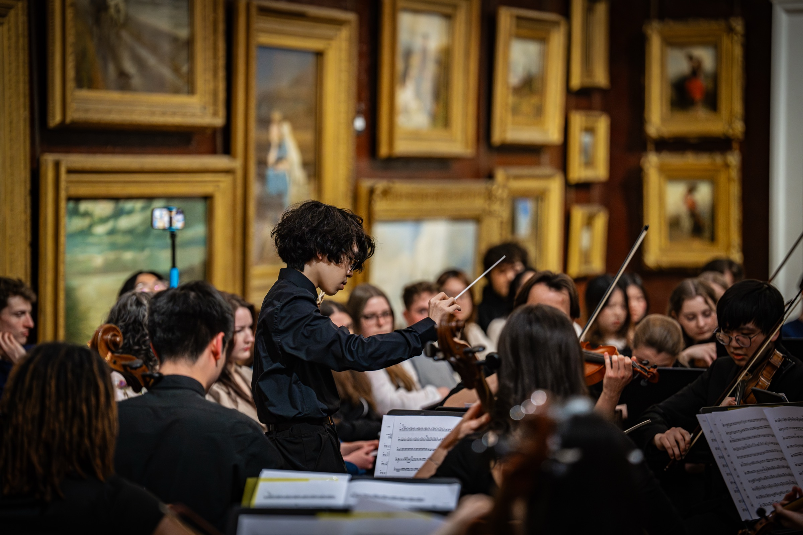

---
hide:
  - toc
---

# Overview
<ul class="rotator" data-rotate="7000" markdown>
<li markdown>
Conrad really has something. That right there is good conducting because they actually listen to the
music.
Denise Ham
</li>
</ul>
{ .inset .side }

As an emerging orchestral conductor with experience across symphonic, string, and wind ensemble repertoire, they are currently the Principal Conductor of the String Society and Assistant Conductor of the Wind Orchestra at Royal Holloway, University of London.

[Full Biography →](biography.md)

**Available for engagements** — assistant, cover conducting, sectionals, full projects, and longer-term positions.

[Enquiries →](enquiries.md)

