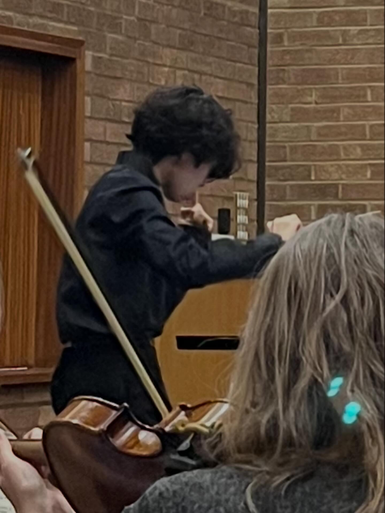

---
hide:
  - toc
---

# Media

## Recordings

<iframe loading="lazy" src="https://www.youtube.com/embed/videoseries?list=PLC4E8-OVLFsc" title="Conducting Portfolio playlist" allow="accelerometer; autoplay; clipboard-write; encrypted-media; gyroscope; picture-in-picture; web-share" referrerpolicy="strict-origin-when-cross-origin" allowfullscreen></iframe>

Conducting Portfolio — <a href="https://www.youtube.com/playlist?list=PLC4E8-OVLFsc">open the playlist on YouTube</a>.

## Gallery

## Social media

:fontawesome-brands-youtube:{ .lg }
### YouTube
[Conducting Portfolio](https://www.youtube.com/playlist?list=PLC4E8-OVLFsc)

:fontawesome-brands-instagram:{ .lg }
### Instagram
[conradho._.music](https://www.instagram.com/conradho._.music/)

