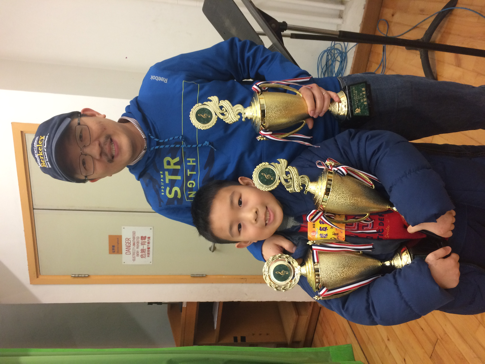
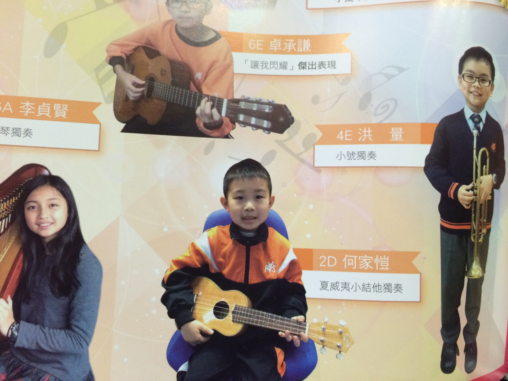
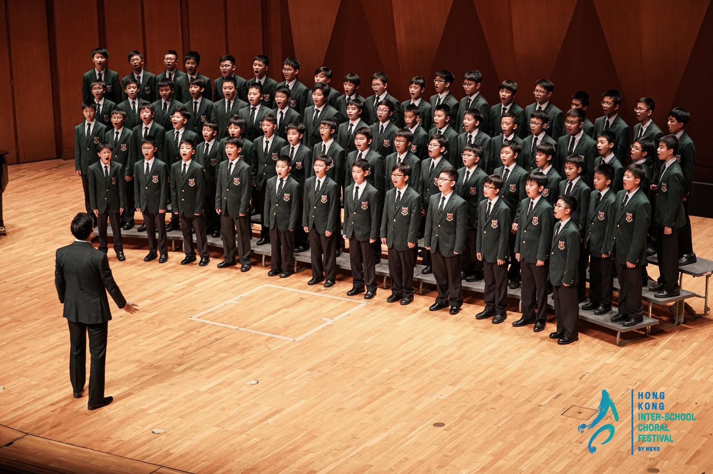

# Music

## Early Age
As a young toddler in Hong Kong, I began music journey with the Junior Music Course at Tom Lee where I had choir experience and group piano lessons with my dad who has always been a major influence in my music making.

## Primary School
In 2nd Year of Primary School, upon hearing an outreach recital played by members of the [Hong Kong Philharmonic](https://www.hkphil.org/), that day I decided to start learning the flute. Since then, I began journey as a flautist for many years to come.

<video width="1920" height="1080" controls>
  <source src="musicphotos/IMG_0915.MOV" type="video/mp4">
</video>
<em> Video of me (aged ~8) playing with my brother </em>

Apart from Flute, I also had a brief period of singing and ukulele (upon inspiration by my uncle John!). With my Dad and my brother, we also won singing competitions as a family in two separate years. These led to opportunities to perform at the school's annual concert.

{ width="250"}
{ width="400"}

Later on in my primary school years, I also joined the school's wind band led by Ms. Wing Kam Chau. After graduating, I also joined Ms. Chau's [Hong Kong Harmonious Wind Philharmonic](https://www.facebook.com/hkwe.hk/).

---
## Secondary School/Middle School
{ width="350", align="left"}
Around 2021, just after COVID, I started to realise my interests in Music and started to treat it more seriously. Apart from my flute lessons with [Mr. Raymond Yuen](https://www.youtube.com/@ray.flautist), I also started taking violin lessons, under the inspiration of [TwoSetViolin](https://www.youtube.com/@twosetviolin) and [Ray Chen](https://www.youtube.com/@RayChenViolinist), with [Mr. Arthur Choi](https://www.linkedin.com/in/arthur-choi-324110310/?originalSubdomain=hk).

During the time at my Secondary School, I also became a member of the Junior Choir [@Wah Yan College Kowloon](https://wyk.edu.hk/student-organizations-2/#1566404896866-b559880f-afda). I also had the opportunities to be part of and perform as a Woodwind Quartet in the annual concert May 2021 just prior to heading to the UK.

---

## Junior Conservatoire
After a year with [Ms. Anette Kormann](https://www.youtube.com/@anettekormann4672) in addition to online lesson with Mr. Yuen and Mr. Choi, I decided to try my luck and applied to the Junior Department of Royal Birmingham Conservatoire. To my surprise, I was absolutely delighted finding out that I got accepted. During my time at JRBC, I was taught by [Ms. Liz Wrighton](https://www.bcu.ac.uk/conservatoire/about-us/birmingham-conservatoire-tutors-and-staff/elizabeth-wrighton) and [Mr. Sam Mason](https://www.midlandchamberplayers.org.uk/players.aspx).

By the end of my 1st year at JRBC, the wind orchestra director [Jeff Snowdon](https://www.bcu.ac.uk/conservatoire/about-us/birmingham-conservatoire-tutors-and-staff/jeff-snowdon) made a call for student composition to be played by the ensemble and those submitted had the opportunities to conduct it ourselves. Naturally, I again tested my luck and proposed a piece 'Sinfonia Concertante'. Due to, however, a number of reasons, I was offered to do this piece in a concert next year. During the sightreading session, Mr. Snowdon appreciated my conducting skills and suggested that I study conducting under [Ms. Margarita Mikhailova](https://muzikfermata.com/about-us/)

Then the next year came - After working further on the piece over the summer, I am finally priemered the piece in Feburary 2024.

<iframe width="1020" height="400" src="https://www.youtube.com/embed/r7d79fsdrKI?si=TX21Zh0BJDLmq5Je" title="YouTube video player" frameborder="0" allow="accelerometer; autoplay; clipboard-write; encrypted-media; gyroscope; picture-in-picture; web-share" referrerpolicy="strict-origin-when-cross-origin" allowfullscreen></iframe>

---
## Royal Holloway

### Year 1 
In September 2024, I began my study as a Physics with Music student at Royal Holloway. Despite switching to a different course due to time clashes between the two department, I continued my music activity.

{ width="200"}
{ width="250"}
{ width="250"}
.JPG){ width="250"}

I served briefly as Junior Assistant Conductor to [Ms. Rebecca Miller](https://www.rebeccamiller.net/). I am also an active member of String Society and Conductor's Collective.

### Year 2 
In 2nd year, I am serving as the Conducting Coach for Conductor's Collective.
