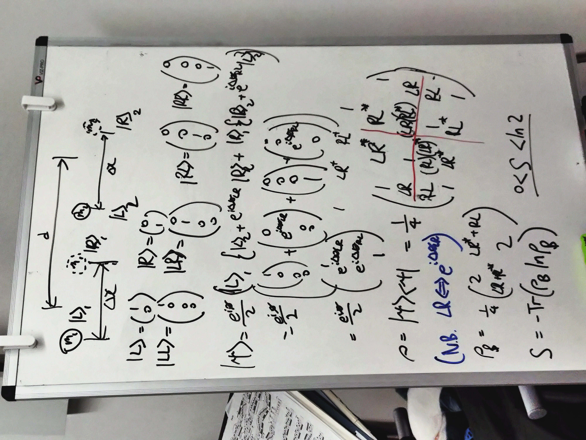

# Introduction
{width="300", align="Left"} In August 2025, I did a summer research project with [Dr. Richard Howl](https://pure.royalholloway.ac.uk/en/persons/richard-howl) on the study of Casimir Effect and how it may be used as a probe/test of Quantum Gravity.

This project in specific also looked at Casimir Effect applied to the [Bose-Marletto-Vedral (BMV) proposal]((https://journals.aps.org/prl/pdf/10.1103/PhysRevLett.119.240401)) in 2017 with the idea of using two entanglement masses to probe the quantum mechanical nature (or lack thereof) of Gravity. 

  