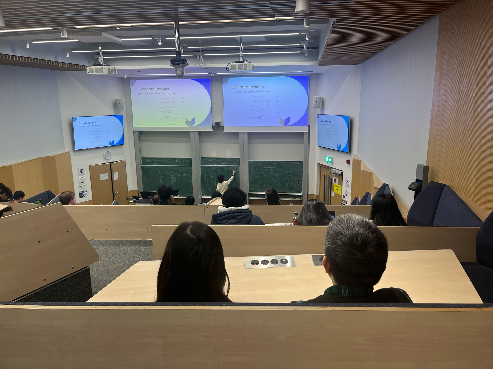
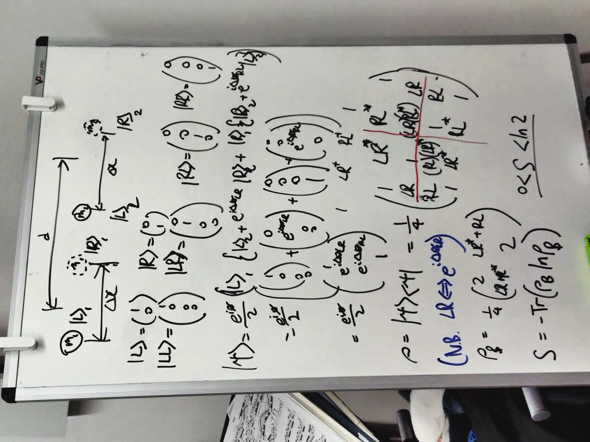

# Physics

{ .inset .side }

Curious-minded and dedicated 3rd year Theoretical Physics (BSc.) student at
[Royal Holloway](https://www.royalholloway.ac.uk/studying-here/undergraduate/physics/theoretical-physics-bsc/)
with significant research experience gained through past and ongoing projects. Aspiring to pursue a career in Mathematical Physics, particularly in Quantum Foundations.

## Research interests

### Testing quantum gravity

>Unifying General Relativity and Quantum Theory is one of the open problems of Physics. In recent years, some — such as the so-called BMV test — have proposed tests of Quantum Gravity which would enable a first experimental verification of whether a quantum theory of gravity should exist.

### Collapse models

> Another open problem in the field of Quantum Foundations is that of the Measurement Problem. Motivated by this, one possible "way out" is that of Collapse Models.

### Where the two meet

> Inspired by Roger Penrose's idea of gravity-induced collapse, I am also interested in the intersection of testing quantum gravity and collapse models, where one may benefit from — or interfere with — the other.

{.side }

## Academic record

**Year 3** · in progress
:   ~85% — on track for a 1st

**Year 2**†
:   83.6%

**Year 1**
:   69%

† Year 2 highlights: **Mathematical Methods 96%**, **Quantum Mechanics 90%**.

## Awards and funding

Competitive Funding Summer Research Project — CQER-IQ, SEPnet
:   **£3,560, Jun–Aug 2026.** Competitive funding supported an 8-week summer research project under
    the SEPnet summer placement scheme.

Competitive EPMS School Grant for Academic Activities — Royal Holloway
:   **~£160, Sep 2024 – present.** Supported attendance at 'Gravity, Entanglement, and Entropy' 2026, CUWiP+ 2025, and QUIRK+ 2025 and 2026.

## Beyond Research

### Women and Non-Binary in Physics Committee — Current 3rd Year Representative
**Royal Holloway, Sep 2024 – present**

- Previously served as 1st and 2nd Year Representative, and as Secretary.
- Contributed to event organisation and outreach initiatives promoting DEI in Physics.
- Presented summer research to 40+ audience, consisting of peers across cohorts and academics within
  the department.

### Home Server Project
**Jul 2025 – Present**

- Built and maintained a self-hosted server running OpenMediaVault, Home Assistant, Open WebUI, and
  Immich.
- Configured Docker containers and secure remote access via Tailscale VPN.

### Tutoring

I tutor online for Maths and Physics up to High School and 1st year undergrad level respectively! [More →](../tutoring.md)

## Skills

Programming and computing
:   Python (NumPy, SciPy, Matplotlib, QuTiP, PyTorch), Wolfram Mathematica, Linux, Docker, Git,
    Server Administration, LaTeX

Research and scientific
:   Numerical simulation, machine learning, scientific writing, oral presentations, literature
    review, independent research, teamwork

Languages
:   English (Native), Cantonese (Native), Mandarin (Fluent), German (Beginner), Japanese (Beginner)
